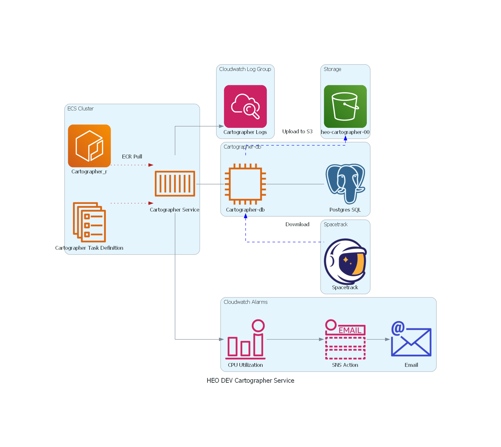

<!-- BEGIN_TF_DOCS -->

## HEO Dev Cartographer Service
Cartographer is a state management service for HEO. It is intended to serve as a
single source of truth for position and state information about relevant space objects.
https://heo.atlassian.net/wiki/spaces/DEV/pages/244908033/Cartographer%3A+HEO+State+Management

## Providers

| Name | Version |
|------|---------|
|  [aws](#provider\_aws) | 5.55.0 |
|  [aws.prod](#provider\_aws.prod) | 5.55.0 |
## Requirements

| Name | Version |
|------|---------|
|  [aws](#requirement\_aws) | ~> 5.55.0 |

## Variables and Data resources in use

## Inputs

| Name | Description | Type | Default | Required |
|------|-------------|------|---------|:--------:|
|  [cartographer-okapi-etl-lambda](#input\_cartographer-okapi-etl-lambda) | n/a | `string` | `"cartographer-okapi-etl-lambda"` | no |
|  [container\_name](#input\_container\_name) | n/a | `string` | `"cartographer-prod"` | no |
|  [container\_port](#input\_container\_port) | n/a | `string` | `"80"` | no |
|  [cw\_metric\_filter\_pattern](#input\_cw\_metric\_filter\_pattern) | n/a | `string` | `"?ERROR ?Error ?error"` | no |
|  [ecr\_image](#input\_ecr\_image) | n/a | `string` | `"048955030943.dkr.ecr.ap-southeast-2.amazonaws.com/cartographer_r"` | no |
|  [ecs\_name](#input\_ecs\_name) | # ECS Service variables | `string` | `"cartographer"` | no |
|  [environment](#input\_environment) | the environment to deploy into | `string` | `"prod"` | no |
|  [health\_monitor\_lambda](#input\_health\_monitor\_lambda) | Health Monitor Lambda | `string` | `"cartographer-health-monitoring-lambda"` | no |
|  [health\_monitor\_lambda\_uri](#input\_health\_monitor\_lambda\_uri) | location of lambda image | `string` | `"dkr.ecr.ap-southeast-2.amazonaws.com/cartographer_health_monitoring_lambda_r:latest"` | no |
|  [health\_monitor\_objects](#input\_health\_monitor\_objects) | n/a | <pre>map(object({     name    = string     pattern = string     }     )   )</pre> | <pre>{   "general-errors": {     "name": "General-Errors",     "pattern": "?ERROR ?Error ?error"   },   "invalid_compressed_data": {     "name": "Invalid-Compressed-Data",     "pattern": "%Invalid-Compressed-Data%"   },   "omm_health_check_failed": {     "name": "OMM-Health-Check-Failed",     "pattern": "%OMM health check failed%"   },   "sp_health_check_failed": {     "name": "SP-Health-Check-Failed",     "pattern": "%SP health check failed%"   } }</pre> | no |
|  [health\_monitors](#input\_health\_monitors) | Tags to set for all resources | `map(string)` | <pre>{   "general-errors": "General-Errors",   "invalid compressed data": "Invalid-Compressed-Data",   "omm health check failed": "OMM-Health-Check-Failed",   "sp health check failed": "SP-Health-Check-Failed" }</pre> | no |
|  [host\_port](#input\_host\_port) | n/a | `string` | `"4305"` | no |
|  [instance\_type](#input\_instance\_type) | n/a | `string` | `"t2.micro"` | no |
|  [postgres\_name](#input\_postgres\_name) | Cartographer postgres database container | `string` | `"postgres"` | no |
|  [postgres\_port](#input\_postgres\_port) | n/a | `string` | `"5432"` | no |
|  [resource\_tags](#input\_resource\_tags) | Tags to set for all resources | `map(string)` | <pre>{   "creator": "terraform",   "heo:env:service": "prod:Cartographer" }</pre> | no |
|  [schedule\_lambda](#input\_schedule\_lambda) | lambda target for the eventbridge targets | `string` | `"arn:aws:lambda:ap-southeast-2:048955030943:function:cartographer-spacetrack-etl-lambda"` | no |
|  [service\_discovery](#input\_service\_discovery) | n/a | `string` | `"heo-inspect-cluster"` | no |
|  [sns\_endpoint](#input\_sns\_endpoint) | sns endpoint for the alert message | `string` | `"https://global.sns-api.chatbot.amazonaws.com"` | no |
|  [sns\_topic\_name](#input\_sns\_topic\_name) | Name of SNS Topic | `string` | `"HEO-prod-Infrastructure"` | no |

## AWS Resources in use

## Resources

| Name | Type |
|------|------|
| [aws_cloudwatch_log_group.cartographer-external-ephemeris-etl-lambda](https://registry.terraform.io/providers/hashicorp/aws/latest/docs/resources/cloudwatch_log_group) | resource |
| [aws_cloudwatch_log_group.cartographer-health-monitor](https://registry.terraform.io/providers/hashicorp/aws/latest/docs/resources/cloudwatch_log_group) | resource |
| [aws_cloudwatch_log_group.cartographer-ipupdater](https://registry.terraform.io/providers/hashicorp/aws/latest/docs/resources/cloudwatch_log_group) | resource |
| [aws_cloudwatch_log_group.log-group](https://registry.terraform.io/providers/hashicorp/aws/latest/docs/resources/cloudwatch_log_group) | resource |
| [aws_cloudwatch_log_group.okapi-etl-lambda](https://registry.terraform.io/providers/hashicorp/aws/latest/docs/resources/cloudwatch_log_group) | resource |
| [aws_cloudwatch_log_metric_filter.cartographer_fatal_error_filters](https://registry.terraform.io/providers/hashicorp/aws/latest/docs/resources/cloudwatch_log_metric_filter) | resource |
| [aws_cloudwatch_log_metric_filter.ipupdater_metric_filters](https://registry.terraform.io/providers/hashicorp/aws/latest/docs/resources/cloudwatch_log_metric_filter) | resource |
| [aws_cloudwatch_log_metric_filter.metric_filters](https://registry.terraform.io/providers/hashicorp/aws/latest/docs/resources/cloudwatch_log_metric_filter) | resource |
| [aws_cloudwatch_log_metric_filter.okapi_metric_filters](https://registry.terraform.io/providers/hashicorp/aws/latest/docs/resources/cloudwatch_log_metric_filter) | resource |
| [aws_cloudwatch_metric_alarm.cartographer_fatal_error_filter_alarms](https://registry.terraform.io/providers/hashicorp/aws/latest/docs/resources/cloudwatch_metric_alarm) | resource |
| [aws_cloudwatch_metric_alarm.ec2_95_cpu_utilization_alarm](https://registry.terraform.io/providers/hashicorp/aws/latest/docs/resources/cloudwatch_metric_alarm) | resource |
| [aws_cloudwatch_metric_alarm.ecs_cluster_rocket](https://registry.terraform.io/providers/hashicorp/aws/latest/docs/resources/cloudwatch_metric_alarm) | resource |
| [aws_cloudwatch_metric_alarm.ecs_service](https://registry.terraform.io/providers/hashicorp/aws/latest/docs/resources/cloudwatch_metric_alarm) | resource |
| [aws_cloudwatch_metric_alarm.ipupdater_metric_filter_alarms](https://registry.terraform.io/providers/hashicorp/aws/latest/docs/resources/cloudwatch_metric_alarm) | resource |
| [aws_cloudwatch_metric_alarm.metric_filter_alarms](https://registry.terraform.io/providers/hashicorp/aws/latest/docs/resources/cloudwatch_metric_alarm) | resource |
| [aws_cloudwatch_metric_alarm.okapi_metric_filter_alarms](https://registry.terraform.io/providers/hashicorp/aws/latest/docs/resources/cloudwatch_metric_alarm) | resource |
| [aws_ecr_repository.cartographer-external-ephemeris-etl-lambda](https://registry.terraform.io/providers/hashicorp/aws/latest/docs/resources/ecr_repository) | resource |
| [aws_ecr_repository.cartographer_health_monitoring_lambda_r](https://registry.terraform.io/providers/hashicorp/aws/latest/docs/resources/ecr_repository) | resource |
| [aws_ecr_repository.okapi_lambda](https://registry.terraform.io/providers/hashicorp/aws/latest/docs/resources/ecr_repository) | resource |
| [aws_ecs_service.ecs_service_app](https://registry.terraform.io/providers/hashicorp/aws/latest/docs/resources/ecs_service) | resource |
| [aws_ecs_task_definition.ecs_task_definition_app](https://registry.terraform.io/providers/hashicorp/aws/latest/docs/resources/ecs_task_definition) | resource |
| [aws_iam_policy.cartographer-ecs-task-permissions](https://registry.terraform.io/providers/hashicorp/aws/latest/docs/resources/iam_policy) | resource |
| [aws_iam_policy.cartographer_secrets](https://registry.terraform.io/providers/hashicorp/aws/latest/docs/resources/iam_policy) | resource |
| [aws_iam_policy.s3_policy](https://registry.terraform.io/providers/hashicorp/aws/latest/docs/resources/iam_policy) | resource |
| [aws_iam_policy.scheduler](https://registry.terraform.io/providers/hashicorp/aws/latest/docs/resources/iam_policy) | resource |
| [aws_iam_role.cartographer-ecs-web-role](https://registry.terraform.io/providers/hashicorp/aws/latest/docs/resources/iam_role) | resource |
| [aws_iam_role.cartographer-external-ephemeris-etl-lambda-role](https://registry.terraform.io/providers/hashicorp/aws/latest/docs/resources/iam_role) | resource |
| [aws_iam_role.cartographer-taskexecution-role](https://registry.terraform.io/providers/hashicorp/aws/latest/docs/resources/iam_role) | resource |
| [aws_iam_role.health_monitor](https://registry.terraform.io/providers/hashicorp/aws/latest/docs/resources/iam_role) | resource |
| [aws_iam_role.okapi-etl-lambda-role](https://registry.terraform.io/providers/hashicorp/aws/latest/docs/resources/iam_role) | resource |
| [aws_iam_role.scheduler](https://registry.terraform.io/providers/hashicorp/aws/latest/docs/resources/iam_role) | resource |
| [aws_iam_role_policy.Task_run](https://registry.terraform.io/providers/hashicorp/aws/latest/docs/resources/iam_role_policy) | resource |
| [aws_iam_role_policy.cartographer-external-ephemeris-etl-lambda-policy](https://registry.terraform.io/providers/hashicorp/aws/latest/docs/resources/iam_role_policy) | resource |
| [aws_iam_role_policy.health_monitor_policy](https://registry.terraform.io/providers/hashicorp/aws/latest/docs/resources/iam_role_policy) | resource |
| [aws_iam_role_policy.okapi_role](https://registry.terraform.io/providers/hashicorp/aws/latest/docs/resources/iam_role_policy) | resource |
| [aws_iam_role_policy_attachment.cartographer-ecs-task-permissions](https://registry.terraform.io/providers/hashicorp/aws/latest/docs/resources/iam_role_policy_attachment) | resource |
| [aws_iam_role_policy_attachment.cartographer-external-ephemeris-etl-lambda-attachment](https://registry.terraform.io/providers/hashicorp/aws/latest/docs/resources/iam_role_policy_attachment) | resource |
| [aws_iam_role_policy_attachment.ecs_policy_attachment_AmazonECSTaskExecutionRolePolicy](https://registry.terraform.io/providers/hashicorp/aws/latest/docs/resources/iam_role_policy_attachment) | resource |
| [aws_iam_role_policy_attachment.ecs_policy_attachment_AmazonSSMInstanceCore](https://registry.terraform.io/providers/hashicorp/aws/latest/docs/resources/iam_role_policy_attachment) | resource |
| [aws_iam_role_policy_attachment.ecs_policy_attachment_AmazonSSMReadOnlyAccess](https://registry.terraform.io/providers/hashicorp/aws/latest/docs/resources/iam_role_policy_attachment) | resource |
| [aws_iam_role_policy_attachment.ecs_policy_attachment_CloudWatchAgentServerPolicy](https://registry.terraform.io/providers/hashicorp/aws/latest/docs/resources/iam_role_policy_attachment) | resource |
| [aws_iam_role_policy_attachment.ecs_policy_attachment_ContainerRegistry](https://registry.terraform.io/providers/hashicorp/aws/latest/docs/resources/iam_role_policy_attachment) | resource |
| [aws_iam_role_policy_attachment.ecs_policy_attachment_s3_access](https://registry.terraform.io/providers/hashicorp/aws/latest/docs/resources/iam_role_policy_attachment) | resource |
| [aws_iam_role_policy_attachment.ecs_policy_attachment_secrets_manager](https://registry.terraform.io/providers/hashicorp/aws/latest/docs/resources/iam_role_policy_attachment) | resource |
| [aws_iam_role_policy_attachment.ecs_policy_attachment_secretsmanager](https://registry.terraform.io/providers/hashicorp/aws/latest/docs/resources/iam_role_policy_attachment) | resource |
| [aws_iam_role_policy_attachment.ecs_policy_attachment_web_role_AWSLambda](https://registry.terraform.io/providers/hashicorp/aws/latest/docs/resources/iam_role_policy_attachment) | resource |
| [aws_iam_role_policy_attachment.ecs_policy_attachment_web_role_AmazonRDSDataFullAccess](https://registry.terraform.io/providers/hashicorp/aws/latest/docs/resources/iam_role_policy_attachment) | resource |
| [aws_iam_role_policy_attachment.ecs_policy_attachment_web_role_AmazonSSMFullAccess](https://registry.terraform.io/providers/hashicorp/aws/latest/docs/resources/iam_role_policy_attachment) | resource |
| [aws_iam_role_policy_attachment.ecs_policy_attachment_web_role_SecretsManager](https://registry.terraform.io/providers/hashicorp/aws/latest/docs/resources/iam_role_policy_attachment) | resource |
| [aws_iam_role_policy_attachment.ecs_policy_attachment_web_role_ask_execution](https://registry.terraform.io/providers/hashicorp/aws/latest/docs/resources/iam_role_policy_attachment) | resource |
| [aws_iam_role_policy_attachment.ecs_policy_attachment_web_role_task_execution](https://registry.terraform.io/providers/hashicorp/aws/latest/docs/resources/iam_role_policy_attachment) | resource |
| [aws_iam_role_policy_attachment.scheduler](https://registry.terraform.io/providers/hashicorp/aws/latest/docs/resources/iam_role_policy_attachment) | resource |
| [aws_instance.instance](https://registry.terraform.io/providers/hashicorp/aws/latest/docs/resources/instance) | resource |
| [aws_lambda_function.cartographer-external-ephemeris-etl-lambda](https://registry.terraform.io/providers/hashicorp/aws/latest/docs/resources/lambda_function) | resource |
| [aws_lambda_function.cartographer-health-monitoring-lambda](https://registry.terraform.io/providers/hashicorp/aws/latest/docs/resources/lambda_function) | resource |
| [aws_lambda_function.cartographer-okapi-etl-lambda](https://registry.terraform.io/providers/hashicorp/aws/latest/docs/resources/lambda_function) | resource |
| [aws_scheduler_schedule.cartographer-etl-astroscale-load](https://registry.terraform.io/providers/hashicorp/aws/latest/docs/resources/scheduler_schedule) | resource |
| [aws_scheduler_schedule.cartographer-etl-omm-load](https://registry.terraform.io/providers/hashicorp/aws/latest/docs/resources/scheduler_schedule) | resource |
| [aws_scheduler_schedule.cartographer-etl-sp-load](https://registry.terraform.io/providers/hashicorp/aws/latest/docs/resources/scheduler_schedule) | resource |
| [aws_scheduler_schedule.cartographer-etl-starlink-load](https://registry.terraform.io/providers/hashicorp/aws/latest/docs/resources/scheduler_schedule) | resource |
| [aws_scheduler_schedule.cartographer-health-monitoring](https://registry.terraform.io/providers/hashicorp/aws/latest/docs/resources/scheduler_schedule) | resource |
| [aws_scheduler_schedule.cartographer-okapi-etl](https://registry.terraform.io/providers/hashicorp/aws/latest/docs/resources/scheduler_schedule) | resource |
| [aws_sns_topic.cartographer_errors](https://registry.terraform.io/providers/hashicorp/aws/latest/docs/resources/sns_topic) | resource |
| [aws_ssm_parameter.cartographer-cartographer_health_monitoring_lambda](https://registry.terraform.io/providers/hashicorp/aws/latest/docs/resources/ssm_parameter) | resource |
| [aws_ssm_parameter.cartographer-config](https://registry.terraform.io/providers/hashicorp/aws/latest/docs/resources/ssm_parameter) | resource |
| [aws_ssm_parameter.cartographer-external-ephemeris-etl-lambda-config](https://registry.terraform.io/providers/hashicorp/aws/latest/docs/resources/ssm_parameter) | resource |
| [aws_ssm_parameter.cartographer-okapi-etl-config](https://registry.terraform.io/providers/hashicorp/aws/latest/docs/resources/ssm_parameter) | resource |
| [aws_ssm_parameter.cartographer-spacetrack-etl](https://registry.terraform.io/providers/hashicorp/aws/latest/docs/resources/ssm_parameter) | resource |
| [aws_ssm_parameter.ecsparameter](https://registry.terraform.io/providers/hashicorp/aws/latest/docs/resources/ssm_parameter) | resource |

## Output Information

## Outputs

| Name | Description |
|------|-------------|
|  [Cloudwatch\_logs](#output\_Cloudwatch\_logs) | The Cloudwatch Log group for the Cartographer Service |
|  [ECS\_task\_def\_app](#output\_ECS\_task\_def\_app) | Cartographer App Task definition |
|  [account\_id](#output\_account\_id) | n/a |
|  [astroscale\_etl\_Schedule](#output\_astroscale\_etl\_Schedule) | n/a |
|  [cloudwatch\_alarm](#output\_cloudwatch\_alarm) | Cloudwatch Metric Alarm output |
|  [ecs\_service\_app](#output\_ecs\_service\_app) | ECS Service information for the Cartographer App Service |
|  [etl\_omm\_Schedule](#output\_etl\_omm\_Schedule) | n/a |
|  [instance](#output\_instance) | Show the public IP of the newly created instance |
|  [locals](#output\_locals) | n/a |
|  [log\_metric\_filter](#output\_log\_metric\_filter) | Cloudwatch Metric Alarm output |
|  [metric\_filter\_alarms](#output\_metric\_filter\_alarms) | Cloudwatch Metric Alarm output |
|  [okapi\_etl\_Schedule](#output\_okapi\_etl\_Schedule) | n/a |
|  [sns\_topic](#output\_sns\_topic) | n/a |
|  [sp\_etl\_Schedule](#output\_sp\_etl\_Schedule) | n/a |
|  [subnets](#output\_subnets) | n/a |
|  [task\_role](#output\_task\_role) | Cartographer task execution role |
|  [web\_role](#output\_web\_role) | Cartographer web role |

<!-- END_TF_DOCS -->    